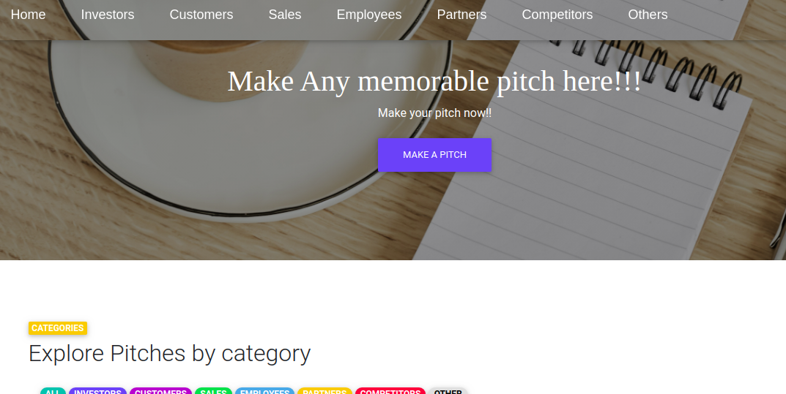

# NEWS APP

#### A Python web application which shows ptches from various users.

#### Live link : https://pitchplatform.herokuapp.com/

## Description

An application which shows pitches from various categories using the python web framework, Flask.

## User Stories

- A user I can view various pithes on the homepage of the application.
- A user can select a pitch and see pitch details from the selected pitch in the application.
- A user can search for a pitch on the homepage.
- A user can see the image, description,author and the time a pitch was created.
- A can click on an article and read the full pitch on the source website.

## Behaviour Driven Development (BDD)

| Behaviour                                                                                        |                                                                      Input                                                                       |                                                                                                 Output |
| ------------------------------------------------------------------------------------------------ | :----------------------------------------------------------------------------------------------------------------------------------------------: | -----------------------------------------------------------------------------------------------------: |
| Page loads, user arrives in the landing page, a list of all available pitch category is displayed. | The user can click on any particular list group item to be directed to a separate page containing pitch highlights pitched by the same publisher. | On clicking the "make a pitch" button, the user is redirected to the main login and signup to allow you make a pitch of ua choice. |  |

## Features

Here are the summary:

- A landing page showing pitch categories.
- Clickable pitches which direct the user to a page with pitch highlights from the particular pitch.

## Requirements

- This program requires python3.+ (and pip) installed, a guide on how to install python on various platforms can be found [here](https://www.python.org/)

##### Contribution

To fix a bug or enhance an existing module, follow these steps:

- Fork the repo
- Create a new branch (`git checkout -b improve-feature`)
- Make the appropriate changes in the files
- Add changes to reflect the changes made
- Commit your changes (`git commit -am 'Improve feature'`)
- Push to the branch (`git push origin improve-feature`)
- Create a Pull Request

### Bug / Feature Request

If you find a bug (the website couldn't handle the query and / or gave undesired results), kindly open an issue [here](https://github.com/HASSAN1A/Pitch-Platform/issues/new) by including your search query and the expected result.
If you'd like to request a new function, feel free to do so by opening an issue [here](https://github.com/HASSAN1A/Pitch-Platform). Please include sample queries and their corresponding results.

## Built with

1. [Python 3.8.2](https://www.python.org/doc/):Programming language.
2. [Flask; Python framework used.](https://flask.palletsprojects.com/en/1.1.x/):Framework used.
3. [HTML](https://www.w3schools.com/html/):Layout.
4. [CSS](https://www.w3schools.com/css/):Styling.
5. [Bootstrap](https://mdbootstrap.com/):For responsive websites.
6. [posgreSQL](https://www.postgresql.org/):Database language.
7. [psycopg2](https://pypi.org/project/psycopg2/):Database driver.

## TEAM

[Hassan Juma ](https://github.com/HASSAN1A)

## [License](https://github.com/HASSAN1A/Pitch-Platform/blob/master/LICENSE.md)

[MIT](https://github.com/HASSAN1A/Pitch-Platform/blob/master/LICENSE.md) © [Hassan Juma](https://github.com/HASSAN1A)
